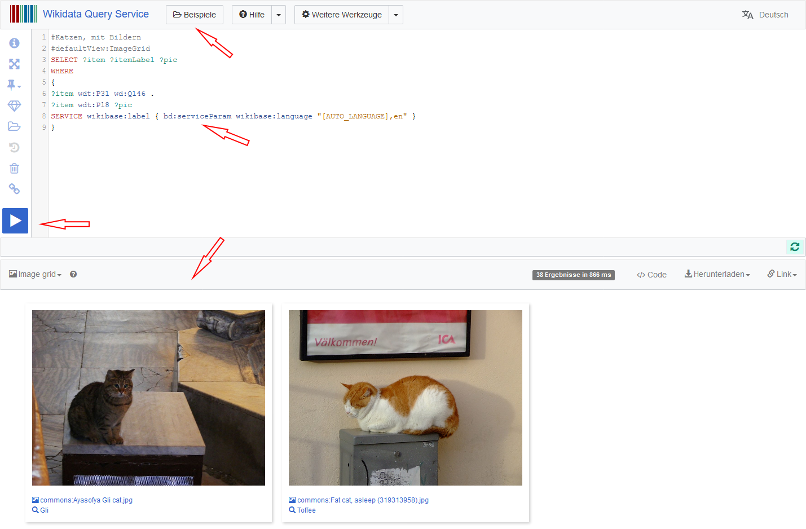

# Wikidata: Wissenshub und Normdatei 

- - - 

## Eine kurze Einführung in Wikidata

- https://dhlab.ub.fau.de/slides/wikidata-tutorial/
- https://github.com/dhlab-ub-fau-de/wikidata-tutorial

---

> Wikidata ist eine freie Wissensdatenbank, die sowohl von Menschen als auch von Maschinen gelesen und bearbeitet werden kann. 

https://www.wikidata.org

---

## Datenmodell

https://de.wikipedia.org/wiki/Wikidata

---

## Wissensnetz und Wissens-Hub

Grundlegende Datenstruktur ist ein Netzwerk / Graph:
- Entitäten: Instanzen, Klassen
- Eigenschaften
- Tripel

Features:
- Qualifikatoren
- fremde Identifikatoren
- Wikimedia-Querverweise

---

## Wie Wikidata nutzen?

- als Normdatei

- als Datenquelle

- als Datensenke

---

## Wikidata als Normdatei

Manuelle Verweise über Identifikatoren:

- Q-Nummer: fortlaufende Nummer
- URI: Linked Data
- persistente URL: Zitation

> > >

---

## Wikidata in OpenRefine nutzen

[OpenRefine](https://openrefine.org) hat eine Wikidata-Schnittstelle zum (semi-)automatischen Abgleich: **Reconcile**

Beispiel: 
- Tabellarische Daten zur [Briefsammlung Trew](https://ub.fau.de/sammlungen/digitale-sammlungen/#collapse_12015) 
- [Datensatz](trew_verfasser_c.csv) (Ausschnitt mit Verfassern mit Buchstabe C)
- Ziel: Verbinde Namen der Verfasser mit Wikidata

> > >

### OpenRefine installieren (Windows)

- [Download](https://openrefine.org/download.html) der Zip-Datei
- Entpacken
- refine.bat ausführen
- Eventuell [Installationsanleitung](https://github.com/OpenRefine/OpenRefine/wiki/Installation-Instructions) beachten (Warnungen, etc.)

- Es sollte automatisch ein Browser-Fenster mit OpenRefine geöffnet werden.

---

## Wikidata als Datenquelle

Wikidata-Daten stehen in unterschiedlicher Form bereit:

- [Dump](https://www.wikidata.org/wiki/Wikidata:Database_download)
- [Linked Open Data (JSON, RDF, etc.)](https://www.wikidata.org/wiki/Wikidata:Data_access#Linked_Data_interface)
- [Sparql-Endpoint](https://query.wikidata.org)

> > >

## Die Sparql-Schnittstelle nutzen

> > >

### Die Sparql-Schnittstelle nutzen

- Die GUI bietet zahlreiche Hilfestellungen für Einsteiger
  - Am besten anhand geeigneter Beispiele eine Anfrage konstruieren
- Verschiedene Visualisierungsmöglichkeiten

- Beispiel: Zeige alle Museen Deutschlands auf einer Karte

---

## Links 

- [Wikidata](https://www.wikidata.org)
- [Sparql Endpoint](https://query.wikidata.org/)

- - -

- [Zugriff auf Daten](https://www.wikidata.org/wiki/Wikidata:Data_access/de)
- [Eingabe/Upload von Daten](https://www.wikidata.org/wiki/Wikidata:Data_donation/de)
- [Übersicht zu Wikidata-Werkzeugen](https://www.wikidata.org/wiki/Wikidata:Tools)

- - -

Tutorials (PDF):
- [Wikidata -- Gentle Introduction for Complete Beginners](https://upload.wikimedia.org/wikipedia/commons/5/5c/Wikidata_-_A_Gentle_Introduction_for_Complete_Beginners_%28Estonia_2017%29.pdf)
- [An Ambitious Wikidata Tutorial](https://upload.wikimedia.org/wikipedia/commons/3/3f/An_Ambitious_Wikidata_Tutorial.pdf)
- [Studon-Kurs zu Sparql mit Wikidata als Anwendungsbeispiel](https://www.studon.fau.de/pg570378_2798870.html) (nur mit Anmeldung in Studon)

