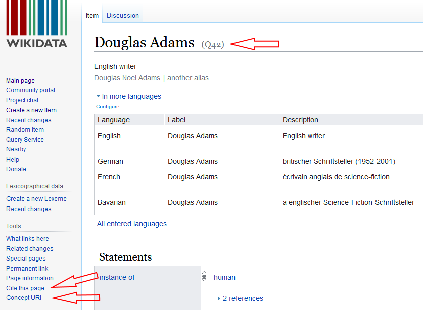

# Eine kurze Einführung in Wikidata

- - - - - - - - - - - - - - - - - - -

> Wikidata ist eine freie Wissensdatenbank, die sowohl von Menschen als auch von Maschinen gelesen und bearbeitet werden kann. 

https://www.wikidata.org

---

## Links 

https://de.wikipedia.org/wiki/Wikidata

https://query.wikidata.org/

- - -

https://www.wikidata.org/wiki/Wikidata:Data_access/de

https://www.wikidata.org/wiki/Wikidata:Data_donation/de

- - -

https://upload.wikimedia.org/wikipedia/commons/5/5c/Wikidata_-_A_Gentle_Introduction_for_Complete_Beginners_%28Estonia_2017%29.pdf

https://upload.wikimedia.org/wikipedia/commons/3/3f/An_Ambitious_Wikidata_Tutorial.pdf

---

## Wikidata Wissensnetz

Grundlegende Datenstruktur ist ein Netzwerk / Graph:

- Entitäten
- Eigenschaften
- Tripel

Extras:
- Label
- Medien
- Eigenschaften von Eigenschaften

---

## Wie Wikidata nutzen?

- als Normdatei

- als Datenquelle

- als Datensenke

---

## Wikidata als Normdatei

Manuelle Verweise über Identifikatoren:

- Q-Nummer: fortlaufende Nummer
- URI: Linked Data
- persistente URL: Zitation

---

## Wikidata als Normdatei

Automatischer Abgleich:

- Einige Werkzeuge haben eine Wikidata-Schnittstelle
  - 
- Beispiel [OpenRefine](https://openrefine.org)

> > >

### Wikidata in OpenRefine nutzen

Funktion *Reconcile*: Automatisches Zuordnen von Datenwerten zu Wikidata-Instanzen

Beispiel-Datensatz: Ausschnitt der [Briefsammlung Trew](https://ub.fau.de/sammlungen/digitale-sammlungen/#collapse_12015) (Verfasser mit Buchstabe C)
- [Datensatz](trew_verfasser_c.csv)

Ziel: Verbinde Namen der Verfasser mit Wikidata

---

## Wikidata als Datenquelle

Wikidata-Daten stehen in unterschiedlicher Form bereit:

- Dump
- Sparql-Endpoint
- LOD: JSON, etc.

> > >

## Die Sparql-Schnittstelle nutzen

[pic]

> > >

### Die Sparql-Schnittstelle nutzen

- Die GUI bietet zahlreiche Hilfestellungen für Einsteiger
  - Am besten anhand geeigneter Beispiele eine Anfrage konstruieren
- Verschiedene Visualisierungsmöglichkeiten

- Beispiel: Zeige alle Museen Deutschlands auf einer Karte

